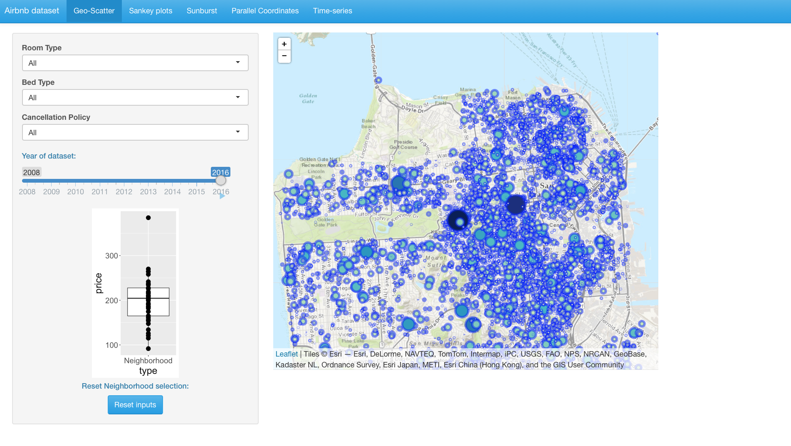
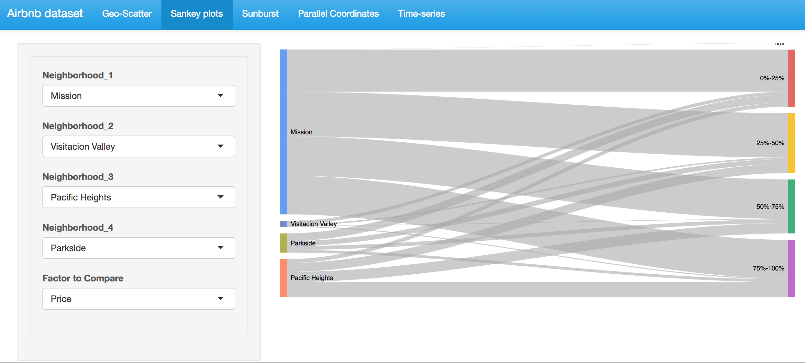
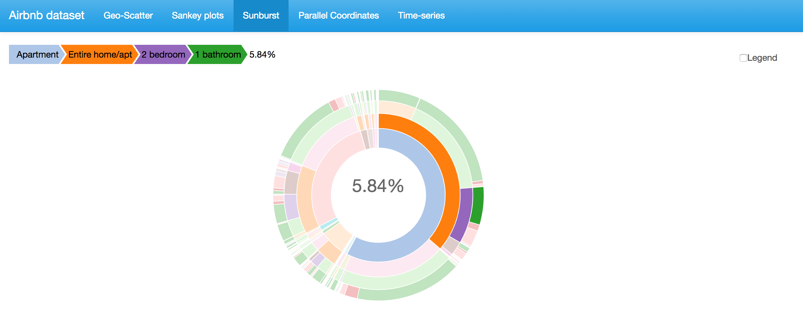
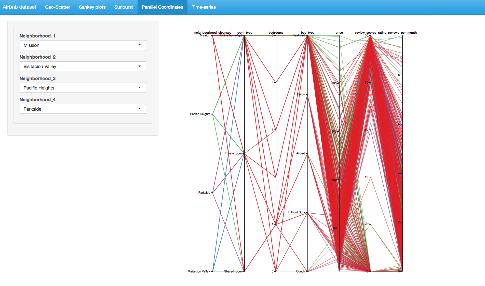
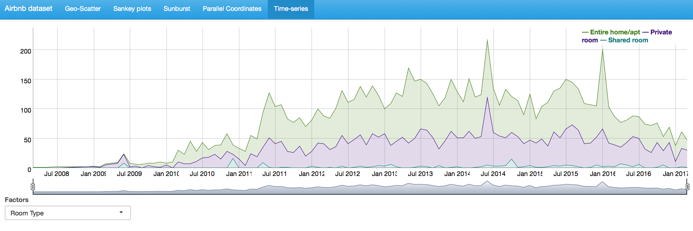

# ShiningData- Airbnb dataset

| **Name**  | Evelyn Peng | Vyakhya Sachdeva|
|----------:|:-------------|:-------------|
| **Email** | ypeng25@usfca.edu |vsachdeva@usfca.edu|

Instructions
----------------------

The following packages must be installed prior to running this code:

- `ggplot2`
- `shiny`
- `leaflet`
- `plotly`
- `sunburstR`
- `googleVis`
- `dygraphs`


To run this code, please enter the following commands in R:

```
library(shiny)
shiny::runGitHub('ShiningData-final', 'usfviz')
```

This will start the `shiny` app. See below for details on how to interact with the visualization.

## Data

Data collect from website Inside Airbnb (http://insideairbnb.com/). It is an independent, non-commercial dataset that allows you to explore how Airbnb is really being used in cities around the world.

This dataset contains 8,706 listings in San Francisco of 6,919 hosts from 2008-2017.

## Tools
Use ggplot2 to make scatter plots, boxplots, etc., and RShiny to perform linking, filtering and other interactions. Also leverage googleVis to create Sankey plot to visualize the growth of AirBnBs in San Francisco.
## Techniques
  ● Geo-scatter plots: Create a scatter plot on San Francisco map, where size/color will be controlled with different parameters like price, rating, etc. There will be a toggle to select one of these parameters. Hovering on a point would show all the other properties about that listing.
  
  ● Box and whisker plot: This plot is linked to the geo-scatter plot. It is controlled using the same toggle of price, rating, etc, and will display the median and quartiles of the selected feature. In addition, we link this with the geo-scatter plot.
  
  ● Sankey Diagram: This illustration shows a Sankey diagram which represents the relationship between neighborhood and different factors. The widths of the bands are directly proportional to number of observation (properties).
  
  ● Sunburst Diagram: It shows hierarchy propotion through a series of rings. Rings are sliced up and divided based on their hierarchical relationship to the parent slice. The angle of each slice is proportional to total number (counts) of each value.
  
  ● Parallel coordinates: The plot compares different factors together and sees the relationships between them. In a Parallel Coordinates Plot, each variable (room type, bedroom, bed type, price, review and rating) is given its own axis and all the axes are placed in parallel to each other for easy comparison.
  
  ● Time series: It shows number of changes between different room-type, property tyep or bed type from 2008 to 2017.

## Discussion

Below are five screenshots of the interface of the shiny app.











## Interactions
  ● Geo-scatter plot: Drop down selection option for region, room type, cancellation policy. Listings that meet the criteria be highlighted.
  
  ● Sankey Diagram: User are able to select up to four neighborhood and one factor (price, number of reviews or rating) to compare.
  
  ● Linkage between geo-scatter plot and box-and-whisker plot. Hovering/brushing on the box-and-whisker plot highlight the listings belonging to that range.
  
  ● Parallel coordinates: Be able to select subset of data on the axis to see the relationship of those observation between different factors. User can select up to four different neighborhoods to compare the differences.
  
  ● Sunburst Diagram: Hover on each node and display detail on the left upper corner.

